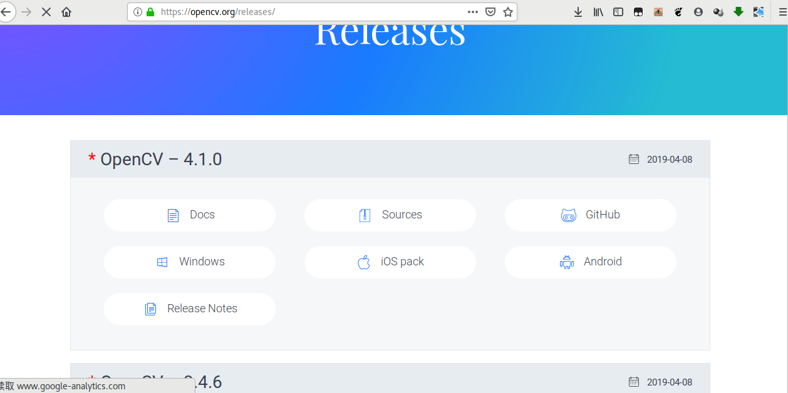

# Android Studio使用OpenCV

## 1. 配置开发环境

1. 下载OpenCV安卓SDK开发包

   

2. as 新建普通的工程，导入opencv模块

   **File->New->Import Module** 找到

   将解压后的sdk下的 **OpenCV-android-sdk/sdk/java** 目录

   

   

导入后的默认是作为**application应用**的，文件夹图标右下角是一个绿色点的,因为下面app要将这个导入的模块作为依赖，所以需要将它变成**library库**

打开导入后的模块的build.grade文件,修改

```groovy
apply plugin: 'com.android.appdaimalication
```

为

```groovy
apply plugin: 'com.android.library'
```

将导入的opencv4模块设置为app的依赖(**Dependencies**)

打开工程结构,选择app的Dependencies,添加Module Dependency,选择刚刚导入的opencv4


4. 复制so库

   在app目录下新建jniLibs文件夹

   复制 解压后的SDK `OpenCV-android-sdk/sdk/native/libs`下的全部文件夹到jniLibs目录下

   

这里可以按需复制

打开app模块的build.gradle文件,添加下面的代码到android节点下


## 测试，视频分解

用VideoCaputer 读取视频，并提取每一帧保存为图片


在Activity里引入加载so库

```java
static{    System.loadLibrary("opencv_java4");}
```

resume函数里(这里是参考官方例子的，在onCreate里初始化一次应该也是可以的)


```java
   if(!OpenCVLoader.initDebug())
        {
        Toast.makeText(this,"init success",Toast.LENGTH_SHORT).show();
        }
        else
        {
            mLoaderCallback.onManagerConnected(LoaderCallbackInterface.SUCCESS);
        }
```

提取帧核心代码

```java
 @Override
    protected String doInBackground(String... strings) {


        VideoCapture video = new VideoCapture(strings[0]);

        Mat frame = new Mat();

        int index = 0;
        while(video.read(frame))
        {
            File out = new File(this.outPath,String.format("%d.png",index));
            Imgcodecs.imwrite(out.getAbsolutePath(),frame);
            index+=1;

            publishProgress(new ExtraMessage(0,index,out.getAbsolutePath()));

        }

        return null;
    }
```

